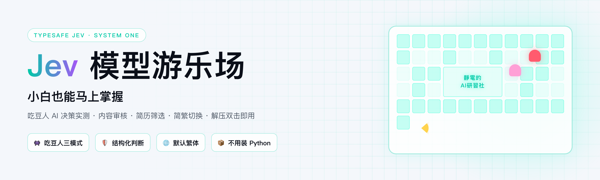
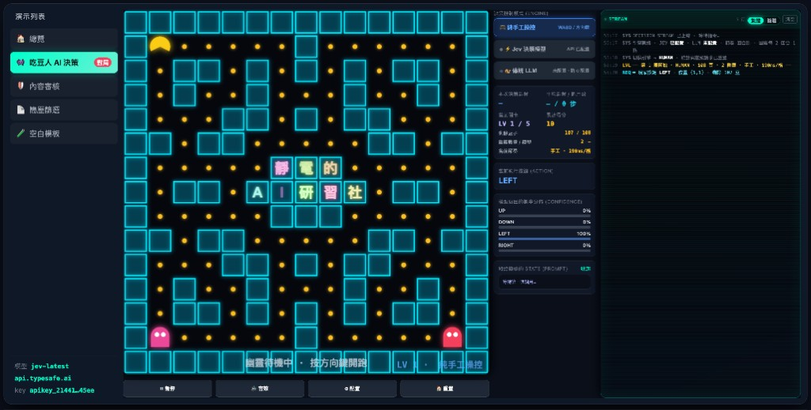

# Jev 模型游乐场

<p align="center">
  <picture>
    <source media="(prefers-color-scheme: dark)" srcset="assets/banner-dark.png">
    
  </picture>
</p>

[Release 下载](https://github.com/evoworkAI/jev-playground/releases) · [YouTube · @j-AI99](https://www.youtube.com/@j-AI99) · [怎么启动.txt](./怎么启动.txt)

**小白也能马上掌握！吃豆人 AI 决策 + 内容审核 / 简历筛选工作台**

解压双击即用，**不用装 Python**。没 API Key 也能先玩吃豆人手工模式。

<p align="center">
  
</p>

<p align="center"><sub>吃豆人 Jev 决策模式 · 每步返回方向 + 概率分布 · 右侧 STREAM 实时日志</sub></p>

---

## 最快启动（推荐 · 不用装 Python）

去 GitHub **Releases** 下载对应系统的 zip：

| 你的电脑 | 解压后双击 |
|---|---|
| **Mac** | `Jev游乐场.app` |
| **Windows** | `Jev游乐场.exe` |

浏览器会自动打开 `http://127.0.0.1:8800/`。

- **没 Key 也能玩**：吃豆人 → 选手工模式 → 开始游戏  
- **想用 AI**：用记事本打开程序旁边的 `.env`，填 `TYPESAFE_API_KEY=`，保存后重新启动  
- **关闭**：关掉弹出的黑色窗口（Mac 上 Cmd+Q 退出 `.app`）

Mac 首次若提示「无法打开」：**右键 → 打开 → 打开**（只需一次）。

---

## 备选：源码 zip（需要 Python）

1. GitHub **Code → Download ZIP**，解压  
2. Mac 双击 `start-mac.command`，Windows 双击 `start-windows.bat`  
3. 电脑需安装 [Python 3.10+](https://www.python.org/downloads/)（Windows 安装时勾选 Add to PATH）

更详细的说明见 [`怎么启动.txt`](./怎么启动.txt)。

---

## 里面有什么

| Tab | 内容 |
|---|---|
| 总览 | Jev 是什么、怎么用 |
| 吃豆人 | 手工 / Jev / LLM 三种控制模式 |
| 内容审核 | 中文评论分类示例 |
| 简历筛选 | 多维度打分示例 |
| 空白模板 | 从零搭自己的判断任务 |

右上角可切换 **繁體 / 简体**（默认繁体）。

---

## 手动启动（开发者）

```bash
cd jev-playground
cp .env.example .env    # 可选
python3 hub/server.py --port 8800
# 浏览器打开 http://127.0.0.1:8800/
```

打包独立程序（维护者）：

```bash
python3 packaging/build.py
```

---

## 常见问题

**Q：双击 HTML 打不开 / 按钮没反应？**  
A：必须通过 `Jev游乐场.exe` / `Jev游乐场.app` 或启动脚本运行，不能直接双击 HTML。

**Q：提示端口被占用？**  
A：关掉之前没关干净的启动窗口，或重启电脑后再试。

**Q：Jev 模式显示「未配置」？**  
A：在 `.env` 里填 `TYPESAFE_API_KEY`，或在吃豆人「配置」弹窗里填 key。

**Q：为什么必须本地跑，不能纯网页？**  
A：Jev API 不允许浏览器直连（CORS 限制），需要本地一个小服务转发请求。

---

## 项目结构

```
jev-playground/
├── assets/                  ← README banner / 界面截图 / 微信二维码
├── start-mac.command        ← 源码版 Mac 启动（需 Python）
├── start-windows.bat        ← 源码版 Windows 启动（需 Python）
├── packaging/build.py       ← 独立程序打包
├── hub/                     ← 门户页 + 后端（主入口）
├── pacman_demo/             ← 吃豆人
├── playground/              ← 完整调试台（/playground/）
└── zh/                      ← 简繁切换
```

---

## 加个微信

新 demo、Jev 玩法、改稿和规则迭代，我会发在「静电的 AI 研习社」。想聊这个游乐场，或者提功能建议，扫码加我。

<p align="center">
  
</p>

不收费，也不用转发集赞。扫码加不上（微信偶尔会拦）就到 [Issues](https://github.com/evoworkAI/jev-playground/issues) 说一声。

---

**Release** [v1.0.0](https://github.com/evoworkAI/jev-playground/releases) · **YouTube** [@j-AI99](https://www.youtube.com/@j-AI99) · **打包说明** [packaging/README.md](./packaging/README.md)

**许可** MIT · 简繁转换使用 [OpenCC](https://github.com/BYVoid/OpenCC)（`zh/opencc-cn2t.js`）
